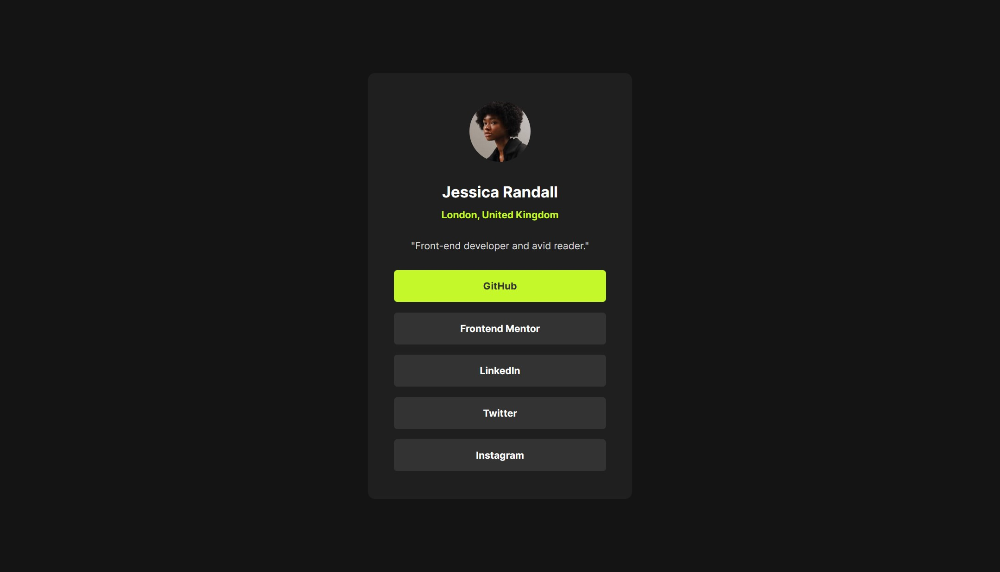

# Social links profile challenge by Frontend Mentor

This is a solution to the [Social links profile challenge on Frontend Mentor](https://www.frontendmentor.io/challenges/social-links-profile-UG32l9m6dQ).

## Table of contents

- [Overview](#overview)
  - [The challenge](#the-challenge)
  - [Screenshot](#screenshot)
  - [Links](#links)
- [My process](#my-process)
  - [Built with](#built-with)
  - [What I learned](#what-i-learned)
  - [Useful resources](#useful-resources)
- [Author](#author)

## Overview

### The challenge

Users should be able to:

- See hover and focus states for all interactive elements on the page

### Screenshot



### Links

- Solution URL: [Add solution URL here](https://your-solution-url.com)
- Live Site URL: [Add live site URL here](https://your-live-site-url.com)

## My process

### Built with

- Semantic HTML5 markup
- CSS custom properties
- Flexbox

### What I learned

Throughout this project, I've discovered the transformative power of Flexbox in crafting responsive layouts, providing a seamless experience across various devices. Transitioning from inline-block elements to Flexbox has not only streamlined the design process but also mitigated layout inconsistencies. Furthermore, implementing subtle box-shadow transitions upon hover has elevated the aesthetics and interactivity of the interface, enhancing user engagement.

Here's a snippet demonstrating the use of Flexbox

```css
#profile-details-container {
  display: flex;
  flex-direction: column;
  width: 100%;
  align-items: center;
}
```

### Useful resources

- [Frontend Mentor](https://www.frontendmentor.io/challenges/blog-preview-card-ckPaj01IcS) - Got this challenge from Frontend Mentor,along with workfiles like required designs, icons and other files.

- [MDN Docs](https://developer.mozilla.org/en-US/) - Here's another useful resourse, which is the MDN web Docs itself. It helped me to find, understand and to use code snippets that i didn't knew before.

## Author

- GitHub - [@sayeedmunees](https://github.com/sayeedmunees)
- Frontend Mentor - [@sayeedmunees](https://www.frontendmentor.io/profile/sayeedmunees)
